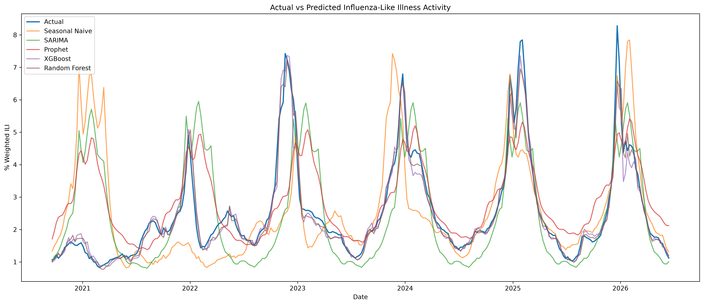
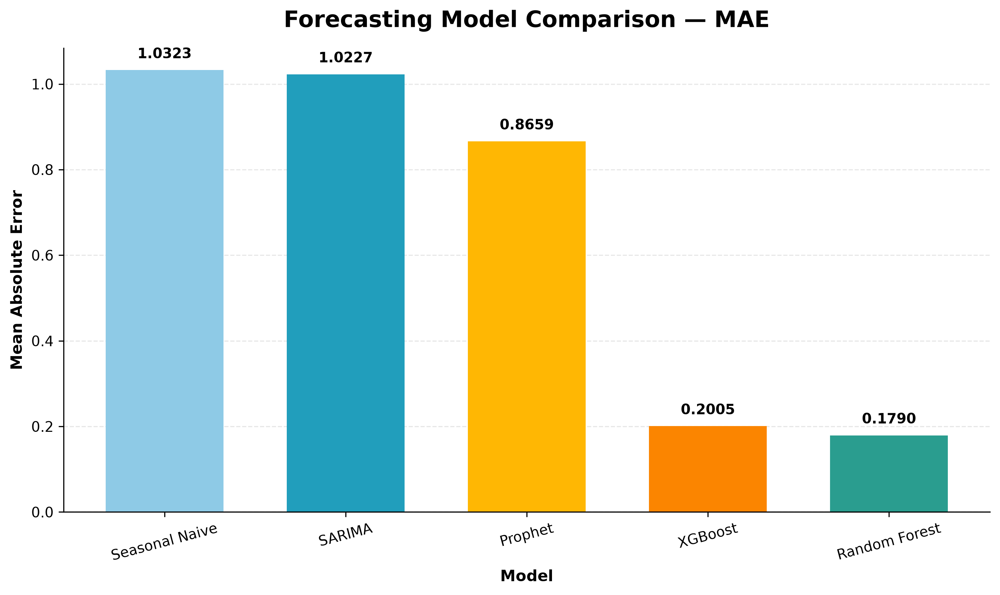
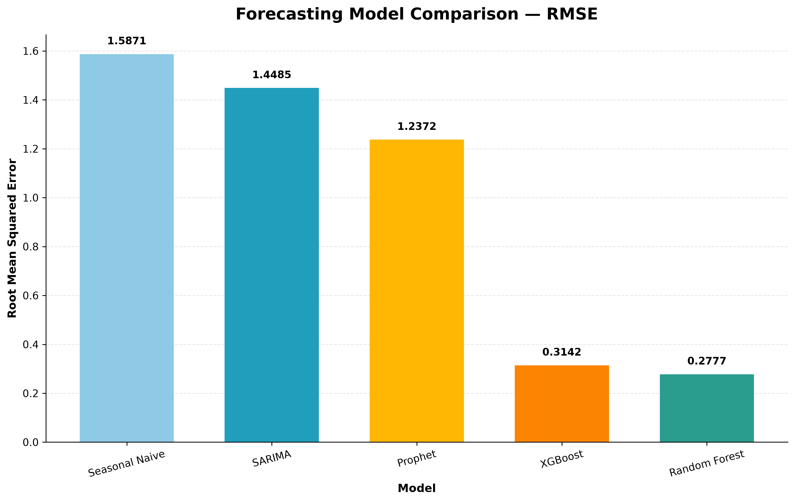
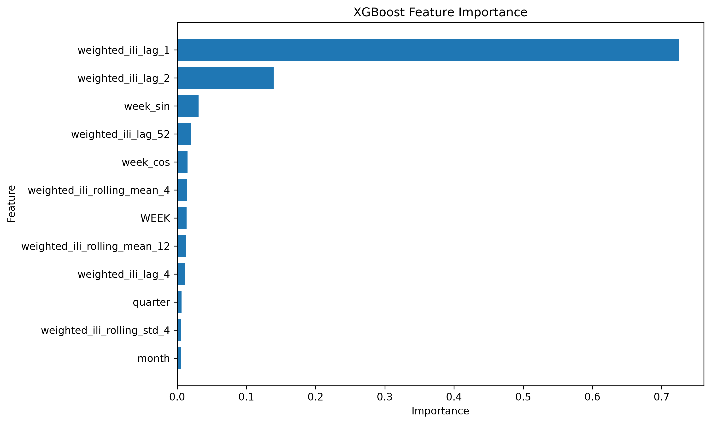
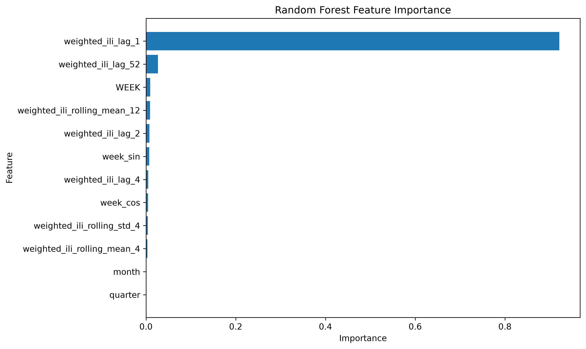

# 🦠 Influenza-Like Illness Forecasting

A time-series forecasting project using **CDC Influenza-like Illness (ILI) surveillance data** to analyze historical weekly ILI activity and develop forecasting models for weekly outpatient ILI levels.

---

## 📌 Overview

This project explores historical weekly influenza-like illness activity and develops forecasting models to predict weekly `% Weighted ILI`.

The project follows a complete data and forecasting workflow, covering:

- Data understanding
- Data cleaning
- Epidemiological week processing
- Time-series preprocessing
- Feature engineering
- Forecasting model development
- Model evaluation
- Forecast visualization
- Feature-importance analysis
- Final output generation

Both **classical statistical forecasting models** and **machine-learning regression models** are evaluated using the same historical dataset and held-out test period.

---

## 🎯 Project Objectives

The main objectives of this project are to:

- Understand historical patterns in weekly ILI activity
- Identify temporal and seasonal patterns
- Prepare epidemiological surveillance data for forecasting
- Engineer features that capture short-term and annual patterns
- Develop statistical and machine-learning forecasting models
- Evaluate forecasting performance using MAE and RMSE
- Compare actual and predicted ILI activity
- Examine the predictive importance of engineered features
- Produce reusable forecasting outputs and visualizations

---

# 🔍 1. Data Understanding

The first stage focused on understanding the structure and characteristics of the raw ILINet dataset.

The analysis included:

- Inspecting dataset dimensions
- Reviewing column names and data types
- Examining summary statistics
- Checking for missing values
- Checking for duplicate records
- Investigating categorical values
- Examining the distribution of reported ILI observations
- Reviewing the structure of the epidemiological week fields

---

# 🧹 2. Data Cleaning

The cleaning stage focused on identifying placeholder values and distinguishing unavailable observations from valid zero values.

### Handling `"X"` Values

`"X"` indicates that a value was not reported under a particular reporting scheme. These values were converted to `NaN`.

Legitimate `0` values were retained as reported observations.

### Cleaning Steps
- Converted `"X"` to `NaN`
- Preserved valid zero values
- Reviewed missing-value patterns
- Checked for duplicates

---

# 🗓️ 3. Data Preprocessing

The cleaned data was converted into a chronological time series.

### Epidemiological Week Processing

The `epiweeks` package was used to convert CDC/MMWR epidemiological year/week values into dates.

An invalid **Week 53 entry for 1997** was corrected to Week 52 before conversion.

### Processing Steps

- Corrected the invalid week
- Created a `DATE` column
- Converted epidemiological weeks to dates
- Sorted observations chronologically
- Removed the non-informative `REGION` column
- Saved the processed dataset

The resulting processed dataset contains **1,499 chronological weekly observations**.

---

# ⚙️ 4. Feature Engineering

The feature-engineering stage created additional variables designed to capture temporal, seasonal, and historical patterns in ILI activity.

## 📅 Calendar Features

The following calendar features were created:

- `month`
- `month_name`
- `quarter`
- `season`

These features provide information about the position of each observation within the calendar year.

## ⏮️ Lag Features

Historical `% Weighted ILI` values were used to create lagged predictors:

- `weighted_ili_lag_1`
- `weighted_ili_lag_2`
- `weighted_ili_lag_4`
- `weighted_ili_lag_52`

The 52-week lag provides an approximate year-over-year comparison for weekly observations.

## 📈 Rolling Features

Rolling statistics were created to represent recent ILI activity and variability:

- `weighted_ili_rolling_mean_4`
- `weighted_ili_rolling_mean_12`
- `weighted_ili_rolling_std_4`

The rolling calculations were shifted before aggregation so that the current target observation was not included in its own predictors.

## 🔄 Cyclical Features

Weekly seasonality was represented using:

- `week_sin`
- `week_cos`

These represent the annual cycle continuously across week boundaries.

### Final Engineered Dataset

The feature-engineering stage expanded the dataset from **15 columns to 28 columns**.

The engineered dataset was saved as:

```text
data/processed/ILINet_engineered.csv
```

---

# ✂️ 5. Train/Test Split

Because this is a time-series forecasting problem, the data was divided chronologically rather than randomly.

The dataset was split into:

- **80% training data**
- **20% test data**

### Training Period

```text
1997-09-28 → 2020-09-13
```

### Test Period

```text
2020-09-20 → 2026-06-14
```
---

# 🤖 6. Forecasting Models

Five forecasting approaches were evaluated.

## 📏 Seasonal Naive Baseline

Uses the `% Weighted ILI` value from approximately **52 weeks earlier** as the forecast.

This provides a simple benchmark for evaluating the more complex forecasting approaches.

## 📉 SARIMA

A Seasonal Autoregressive Integrated Moving Average model was used to capture temporal dependencies and annual seasonality.

The model specification was:

```text
SARIMA(1,0,1)(1,1,1,52)
```

The seasonal period of `52` represents approximately one year of weekly observations.

## 🔮 Prophet

Prophet was used to model temporal patterns and recurring annual seasonality.

For this project:

- Yearly seasonality was enabled
- Weekly seasonality was disabled
- Daily seasonality was disabled

## 🚀 XGBoost

XGBoost was used as a supervised regression model.

Rather than modeling the time series directly, the forecasting problem was represented using engineered predictors including:

- Week
- Month
- Quarter
- Cyclical week features
- Lagged ILI values
- Rolling statistics

## 🌲 Random Forest

Random Forest regression was also used as a supervised forecasting approach.

The model uses historical ILI activity and engineered temporal features to predict weekly `% Weighted ILI`.

---

# 📏 7. Model Evaluation

Models were evaluated using:

## Mean Absolute Error (MAE)

Average absolute difference between actual and predicted values.

## Root Mean Squared Error (RMSE)

Square root of the average squared prediction error, giving greater weight to larger errors.

For both metrics, lower values indicate smaller prediction errors.

---

# 📊 8. Model Performance

The models were evaluated on the held-out test period.

| Model | MAE | RMSE |
|---|---:|---:|
| Seasonal Naive | 1.032 | 1.587 |
| SARIMA | 1.023 | 1.448 |
| Prophet | 0.866 | 1.237 |
| XGBoost | 0.201 | 0.314 |
| Random Forest | 0.179 | 0.278 |

The tree-based models produced substantially lower errors under the evaluation setup used in this project.

---

# 📈 9. Forecast Results

## Actual vs Predicted ILI Activity

The following visualization compares observed `% Weighted ILI` values with predictions from the five forecasting approaches.



---

## MAE Comparison



---

## RMSE Comparison



---

# 🔎 10. Feature Importance

Feature importance was examined for the two tree-based forecasting models.

## 🚀 XGBoost

`weighted_ili_lag_1` was the dominant predictor, followed by other recent-history and seasonal features.



## 🌲 Random Forest

`weighted_ili_lag_1` was also the dominant feature, with the 52-week lag and other temporal features contributing additional predictive information.



> **Note:** Feature importance describes how useful a feature was to the fitted model. It does not establish a causal relationship between the feature and influenza-like illness activity.

---

# 💡 11. Key Findings

- Weekly ILI activity demonstrates strong temporal dependence.
- Recent ILI activity provides substantial predictive information for subsequent observations.
- Annual seasonality is present in the historical series.
- The 52-week lag captures useful year-over-year information.
- Lagged and rolling features allow the tree-based models to capture short-term changes in ILI activity.
- `weighted_ili_lag_1` was the dominant feature in both tree-based models.
- SARIMA and Prophet provide alternative approaches for modeling temporal and seasonal structure.

---

# ⚠️ 12. Limitations

- **ILI is not confirmed influenza:** ILINet measures influenza-like illness rather than laboratory-confirmed influenza.
- **52-week seasonality is approximate:** The 52-week lag represents year-over-year seasonality, although epidemiological years do not always contain the same number of weeks.
- **Evaluation procedures differ:** The tree-based models and Seasonal Naive uses available observations during the test period for rolling predictions, while `SARIMA` and `Prophet` forecast the test period from the end of the training data. Model metrics should therefore be interpreted within their respective forecasting setups.

---

# 📁 13. Project Structure

```text
influenza-ili-forecasting/
│
├── data/
│   ├── raw/
│   │   └── ILINet.csv
│   │
│   ├── cleaned/
│   │   └── ILINet_cleaned.csv
│   │
│   └── processed/
│       ├── ILINet_processed.csv
│       └── ILINet_engineered.csv
│
├── notebooks/
│   ├── 01_data_understanding.ipynb
│   ├── 02_data_cleaning.ipynb
│   ├── 03_preprocessing.ipynb
│   ├── 04_feature_engineering.ipynb
│   └── 05_modeling.ipynb
│
├── outputs/
│   ├── forecasts/
│   │   ├── forecast_comparison.csv
│   │   └── model_comparison.csv
│   │
│   └── figures/
│       ├── actual_vs_predicted.png
│       ├── feature_importance_XGB.png
│       ├── feature_importance_RF.png
│       ├── model_comparison_mae.png
│       └── model_comparison_rmse.png
│
├── src/
│   └── data_loader.py
│
├── .gitignore
├── requirements.txt
└── README.md
```

---

# 🛠️ 14. Technologies

- **Programming**: Python
- **Data processing**: pandas, NumPy
- **Time-series processing**: epiweeks
- **Forecasting**: Statsmodels, Prophet
- **Machine learning**: scikit-learn, XGBoost
- **Visualization**: Matplotlib

---

# ⚙️ 15. Installation

Clone the repository:

```bash
git clone https://github.com/Emmylytics/influenza-ili-forecasting.git
cd influenza-ili-forecasting
```

Create a virtual environment:

```bash
python -m venv .venv
```

Activate the environment on Windows:

```bash
.venv\Scripts\activate
```

Install the project dependencies:

```bash
pip install -r requirements.txt
```

---

# ▶️ 16. Usage

Run the notebooks in the following order:

```text
01_data_understanding.ipynb
        ↓
02_data_cleaning.ipynb
        ↓
03_data_preprocessing.ipynb
        ↓
04_feature_engineering.ipynb
        ↓
05_modeling.ipynb
```

---

## 📊 Dataset

The dataset used in this project comes from the **U.S. Centers for Disease Control and Prevention (CDC) Influenza-like Illness Surveillance Network (ILINet)** and is accessed through CDC FluView.

ILINet collects weekly outpatient healthcare-provider reports of patients presenting with influenza-like illness.

The dataset used in this project contains:

- **1,499 weekly observations**
- **National-level surveillance data**
- Weekly epidemiological observations
- `% Weighted ILI` as the forecasting target
- Age-group reporting variables
- Healthcare-provider reporting variables

🔗 **Data source:** [CDC FluView](https://www.cdc.gov/fluview/)

> **Note:** Influenza-like illness (ILI) is a syndromic surveillance measure and should not be interpreted as laboratory-confirmed influenza infection. ILI can also be caused by other respiratory pathogens.